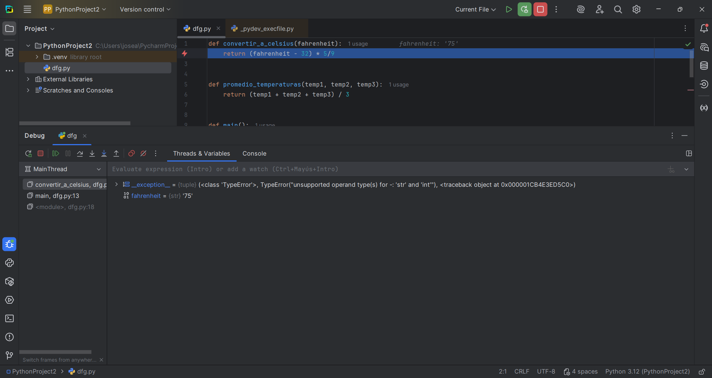
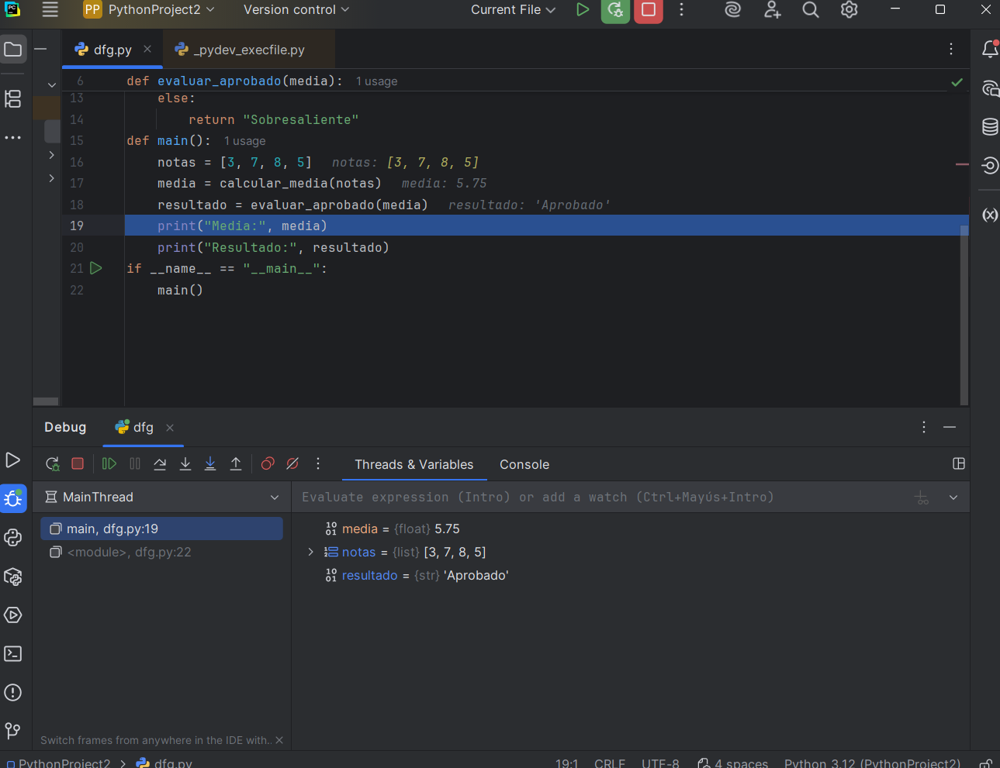
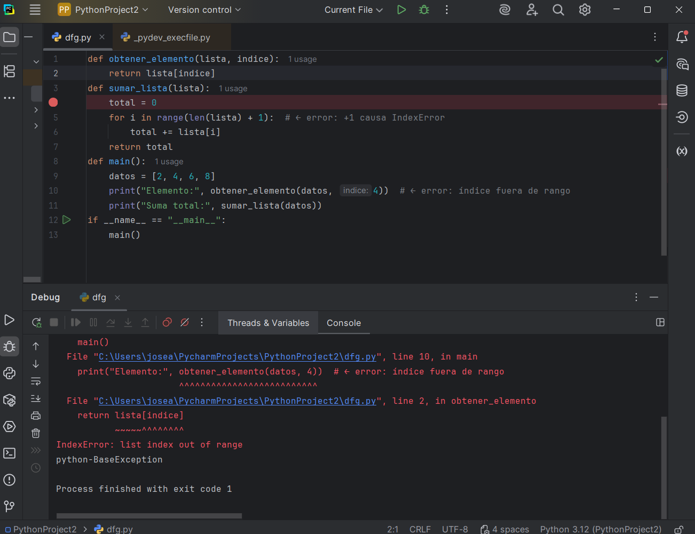

# Actividad 2.2. Depuración en PyCharm
## Hecho por Jose

[Ejercicio 1 – Error de tipo y flujo](Ejercicios/ejercicio1_temperatura.py)

[ Ejercicio 2 – Error lógico y condicional](Ejercicios/ejercicio1_temperatura.py)

[Ejercicio 3 – Error de índice y excepción](Ejercicios/ejercicio1_temperatura.py)

Para esta actividad he usado el depurador desde el inicio para controlar la linea especifica donde da el error, para luego volver a colocar el depurador en dicha línea, la cual me especificaba el error.

Los errores que he encontrado son: IndexError, TypeError y algunos errores lógicos, también como fallo mío han habido errores de identación.